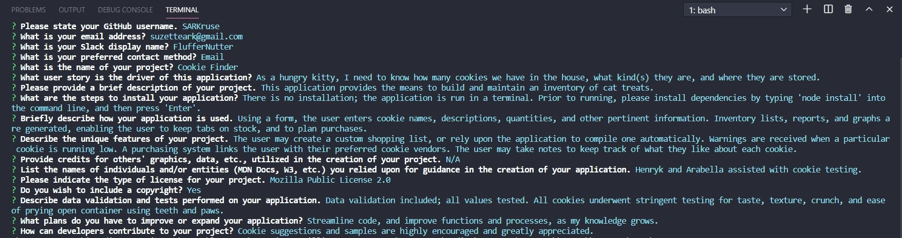

# 09 README.md Generator

## User Story
*AS A developer
I WANT a README generator
SO THAT I can quickly create a professional README for a new project*
 

### Build
* Program assembled using node.js and JavaScript in Bash terminal
* Dependencies used: fs and inquirer
* Markdown file created with user input
 

### Purpose
* Application provides convenient way to write a README markdown file
 

## Installation
* Runs in Bash terminal
* Must type the following into the command line prior to running: npm i
  (This installs dependencies)
 

## Link to walk-thru video
https://drive.google.com/file/d/1A8uqBzmeIdeXtjvwh4tO4T_Ub3lzWHeL/view
 

## Credits
To assemble this project, I relied upon the following:
* Coding Bootcamp classes taught by Michael Labieniec
* W3Schools: https://www.w3schools.com/
* MDN web docs: https://developer.mozilla.org/en-US/
* node.js: https://nodejs.org/en/docs/
* Licenses: https://choosealicense.com/
* Badges: https://badgen.net/
 

## Screenshots
#### Input Entry

 

#### Final README File - View 1

 

#### Final README File - View 2

 

#### Final README File - View 3

 

#### Final README File - View 4

